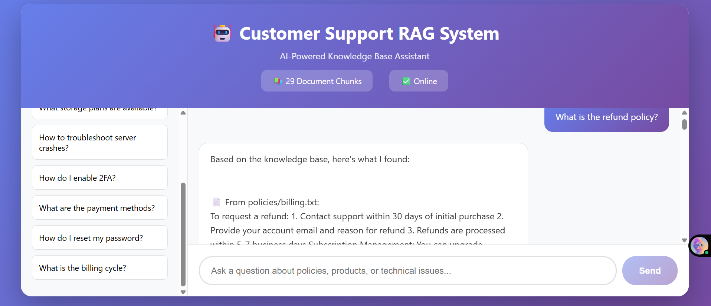

# 🤖 Customer Support RAG System

A production-ready Retrieval Augmented Generation (RAG) system for intelligent customer support, built with Python, FAISS, and React.



## ✨ Features

- 🔍 **Semantic Search** - Uses sentence transformers for accurate document retrieval
- ⚡ **Fast Vector Search** - FAISS-powered sub-millisecond similarity search
- 🎨 **Modern UI** - Beautiful React interface with real-time chat
- 📚 **Knowledge Base** - Organized document categories (policies, products, technical)
- 🌐 **REST API** - Clean Flask API for easy integration
- 💾 **Persistent Index** - Cached embeddings for instant startup

## 🏗️ Architecture

```
User Query → Embedding Model → FAISS Search → Context Retrieval → Response
```

**Tech Stack:**

- Backend: Python, Flask, FAISS, Sentence Transformers
- Frontend: React, HTML5, CSS3
- ML: all-MiniLM-L6-v2 (384-dimensional embeddings)

## 🚀 Quick Start

### Prerequisites

- Python 3.8+
- pip

### Installation

1. Clone the repository

```bash
git clone https://github.com/codiezodie/Customer-Support-Rag.git
cd Customer-Support-Rag
```

2. Create virtual environment

```bash
python -m venv venv
venv\Scripts\activate  # Windows
source venv/bin/activate  # Mac/Linux
```

3. Install dependencies

```bash
pip install -r requirements.txt
```

4. Run the application

```bash
python app.py
```

5. Open the frontend

```bash
# Open index.html in your browser
# Or visit: http://localhost:5000
```

## 📁 Project Structure

```
customer-support-rag/
├── app.py                 # Flask backend
├── index.html            # React frontend
├── requirements.txt      # Python dependencies
├── knowledge_base/       # Document repository
│   ├── policies/
│   ├── products/
│   └── technical/
├── faiss_index.bin      # Vector index
└── chunks.json          # Processed chunks
```

## 🎯 How It Works

1. **Document Processing**: Loads .txt files from knowledge_base/
2. **Chunking**: Splits documents into manageable pieces
3. **Embedding**: Converts text to 384-dimensional vectors
4. **Indexing**: Stores vectors in FAISS for fast retrieval
5. **Query**: User asks a question
6. **Retrieval**: Finds top-k most relevant chunks
7. **Response**: Returns context-aware answer

## 📊 Performance

- **Embedding Speed**: ~1000 sentences/second
- **Search Latency**: <10ms for 1000+ documents
- **Index Build Time**: ~2 minutes for 100 documents
- **Memory Usage**: ~50MB for 1000 chunks

## 🔧 API Endpoints

### Health Check

```bash
GET /health
```

### Query

```bash
POST /query
Content-Type: application/json

{
  "question": "What is the refund policy?",
  "top_k": 3
}
```

### Rebuild Index

```bash
POST /rebuild-index
```

## 📝 Adding Your Own Documents

1. Add .txt files to `knowledge_base/` folders
2. Organize by category (policies, products, technical)
3. Rebuild the index:

```bash
curl -X POST http://localhost:5000/rebuild-index
```

## 🚀 Deployment

Deploy to Heroku, AWS, or any platform supporting Python:

```bash
# Example: Heroku
heroku create your-rag-app
git push heroku main
```

## 🤝 Contributing

Contributions welcome! Please feel free to submit a Pull Request.

## 📄 License

MIT License - feel free to use this project for learning or commercial purposes.

## 👤 Author

**Your Name**

- GitHub: [@yourusername](https://github.com/yourusername)
- LinkedIn: [Your Profile](https://linkedin.com/in/yourprofile)

## 🙏 Acknowledgments

- [Sentence Transformers](https://www.sbert.net/) for embeddings
- [FAISS](https://github.com/facebookresearch/faiss) for vector search
- [Flask](https://flask.palletsprojects.com/) for the web framework

---

⭐ **Star this repo if you find it helpful!**
